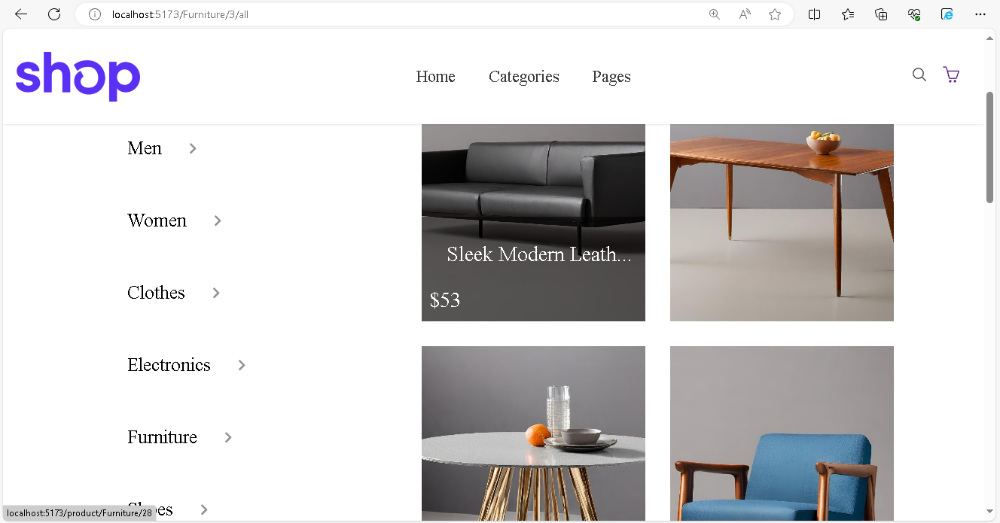

# StoreApp
Visit  Website: [StoreApp](https://duckduckgo.com "StoreApp").
StoreApp is a powerful and easy-to-use application designed to help you manage your store efficiently.

The preparation of the application  is not over yet and continues.

## Features

- Inventory Management: Track and manage your inventory with ease.
- Sales Tracking: Monitor your sales and generate reports.
- Customer Management: Keep detailed records of your customers.
- User-friendly Interface: Intuitive design for easy navigation and use.
- [Add more features as applicable...]
Currently, two official plugins are available:

## Screenshots





## Getting Started

### Prerequisites

- [Node.js](https://nodejs.org/) installed on your machine.

### Installation

1. Clone the repository:

    ```bash
    git clone https://github.com/mruhid/StoreApp.git
    ```

2. Navigate to the project directory:

    ```bash
    cd StoreApp
    ```

3. Install dependencies:

    ```bash
    npm install
    ```

4. Start the app:

    ```bash
    npm run dev
    ```

5. Open your browser and visit [http://localhost:5173](http://localhost:5173) to use the app.

#### Ruhid.Ml


